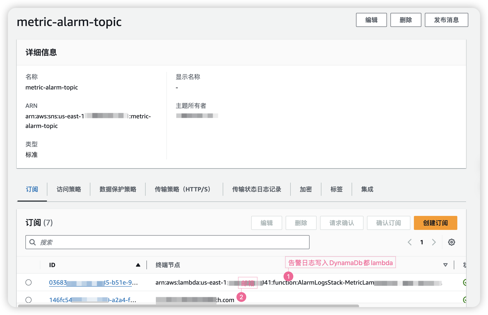
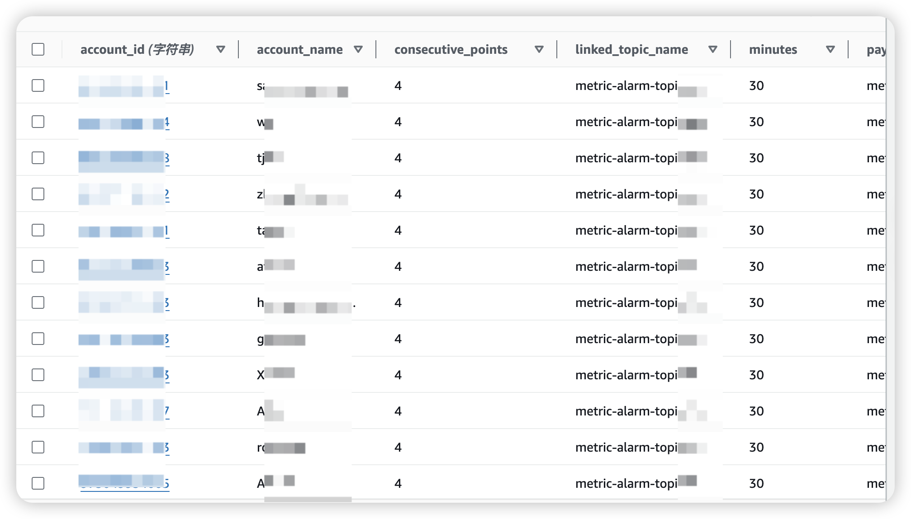
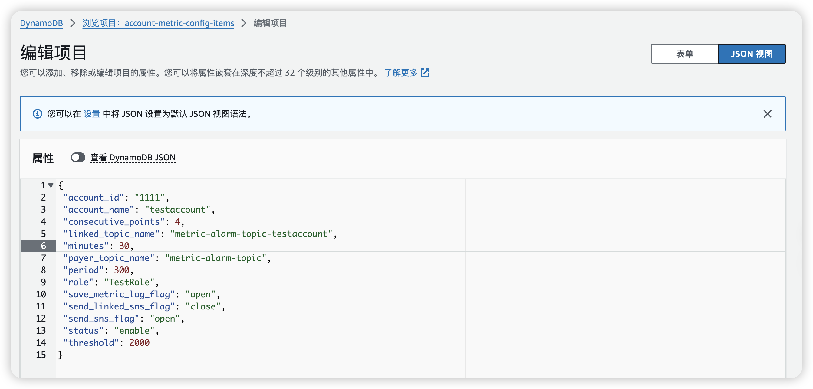

# 介绍
当CloudFront的Request指标超过设定的阈值的时候，发送告警信息,
可以支持发送到SNS、邮件、钉钉、Lark、Telegram
达到可能被DDOS攻击的高阈值的时候，自动停止CloudFront Distribute

阈值设定在配置里面设置，可以通过平时指标数据采集，利用方差算法或者机器学习，计算出告警阈值的数值

Please run `cdk deploy --all` to deploy this stack in your AWS account.
# 部署
## 1.部署CDK应用程序
```
cd ./metric-alarm
# 安装和编译typescript
npm install
npm run build
# 打包requests等依赖包到本地目录下，用于lambda layer
./package_lambda_layer.sh
# 部署EventBridge、lambda、dynamodb到aws
cdk deploy --all
```
本工程会创建
* Cloud Watch EventBridge
* Two Lambda Function
* Two DynamoDB Table

## 2.手动创建SNS

注：
- TOPIC跟下面的配置数据要一致
- 创建订阅也可以在最后步骤再设置

## 3.在DynamoDB设置LinkedAccout的配置数据

table name: account-metric-config-items


Example Record: 
```
{
    "account_id": "123",
    "account_name": "account name",
    "role": "TestAlarmRole",
    "status": "open",
    "consecutive_points": 4,
    "threshold": 1000,
    "minutes": 30,
    "period": 300,
    "consecutive_points": 4,
    "threshold": 5000,
    "auto_disable_service_flag": "open",
    "auto_disable_service_threshold": 10000,
    "send_sns_flag": "open",
    "payer_topic_name": "metric-alarm-topic",
    "send_linked_sns_flag": "close",
    "linked_topic_name": "metric-alarm-topic-xxx",
    'telegram_info': {
        'send_flag': "open",
        "webhook": "https://api.telegram.org/bot{telegram-bot-token}/sendMessage",
        "chat_id": "-4194166355111"
    },
    'lark_info': {
        'send_flag': "open",
        "webhook": "{lark webhook url}"
    },
    'dingding_info': {
        'send_flag': "open",
        "webhook": "{lark webhook url}"
    },
    'linked_telegram_info': {
        'send_flag': "close",
        "webhook": "https://api.telegram.org/{telegram-bot-token}/sendMessage",
        "chat_id": "-4194166355111"
    },
    'linked_lark_info': {
        'send_flag': "close",
        "webhook": "{lark webhook url}"
    },
    'linded_dingding_info': {
        'send_flag': "close",
        "webhook": "{dingding webhook url}"
    }
}
```


注：
- 你可以写一个程序，自动获取payer下的所有账号，自动写入到DynamoDB
- 你可以写一个程序，根据配置自动创建sns
- payer_topic_name必须跟步骤1中创建的sns topic一样
- 所有LinkedAccount的告警都会发送到payer_topic_name
- 如果send_linked_sns_flag为open，则需要创建一个LinkedAccount的sns，topic必须跟linked_topic_name一样，这个只发送这个账号下的告警
# 代码
## lambda代码(python)
```
lambda-code/
    └── metric                 采集&告警的lambda
        ├── index.py           lambda主函数
        ├── metric_manager.py          业务逻辑主体：采集指标、告警
```
## 本地调试

```
# pip install pytest
# pip install moto
# 修改[account_config_manager.py](lambda-code/metric/account_config_manager.py)的get_mock_account_config里面的aws账户，阈值等
pytest -m metric -s
```
## CDK代码(TypeScript)
```
lib
└── metric-alarm-stack.ts   读取配置、采集指标、告警
└── metric-alarm-stack.ts   写入告警日志
```